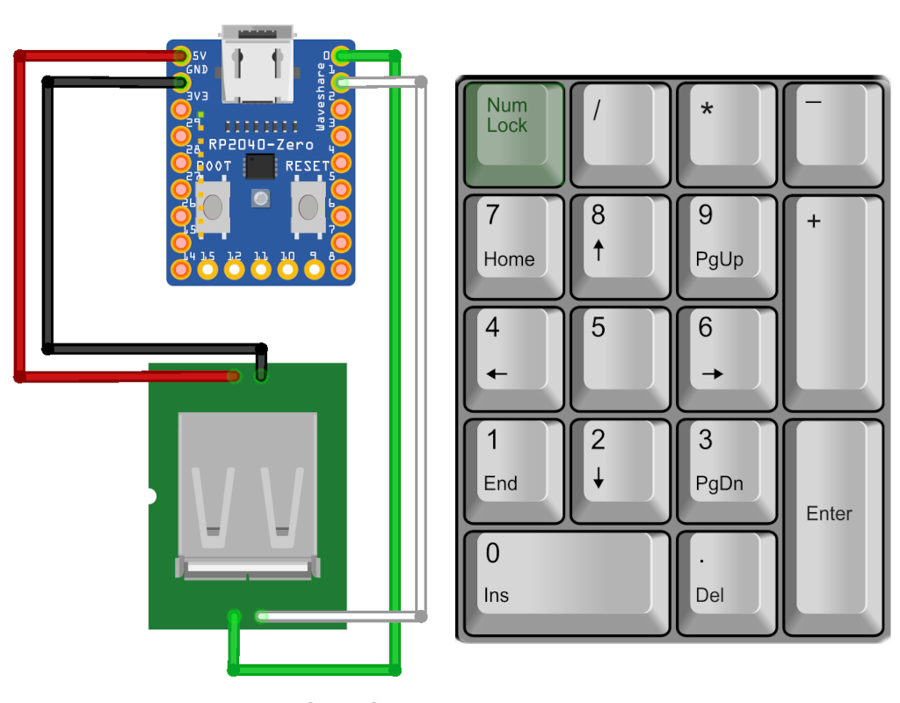

# rp2040-macropad

Turn your dummy usb numeric keypad into a fully hackable macropad.

## What you need:

1. A [Waveshare RP2040-Zero](https://www.waveshare.com/wiki/RP2040-Zero) clone.
2. An usb socket/cable
3. An usb numeric keyboard

## Why?

Because I needed to run some macros and I already have a ~~dummy~~ nice usb keypad. For 5$ and some soldering I now have a macropad :)

## How?

The Pico is configured as a dual role usb host/device. It receives hid reports from the host port (`gp0`**[d+]** & `gp1`**[d-]**) and emits hid reports based on the current layer.

There's a numeric mode that reports key events as they arrived, with the exception of `Bloq num`, which is used to switch between layers.

### Notes

1. This is sample code. I'm sharing it here because I didn't find related projects online.
2. This project has a few layers as an example. Please look at them and adapt them to your needs. But please **do not submit PRs or open tickets** for specific layers.
3. I'm mostly done with this project :). It does exactly what I need and I already run it in production. Do not expect many changes. Patches are welcome as long as they fit the scope of the project: sample code to turn a dummy keypad into a macropad.

### Compile time options:

In `CMakeLists.txt`:

`USE_RGB_LED`: drives a rgb led on gpio16.

`USE_CDC_DEVICE`: enables a composite CDC/HID device instead of a single HID device.
Allows to reboot the rp-2040 board to program mode by typing **dfu** on the serial interface (i.e: `echo "dfu" > /dev/ttyACM0` on Linux)

`USE_EXTRA_KEYS_EPOMAKER_TH21`: `Bloq Num` toggles between numeric mode and last macro layer. `Tab` and `Backspace` are used while in macro mode to switch to previous/next layer.

## Credits
- @hathach for [TinyUSB project](https://github.com/hathach/tinyusb)
- @sekigon-gonnoc for [Pico-PIO-USB](https://github.com/sekigon-gonnoc/Pico-PIO-USB)
- The Pi foundation for such an awesome microcontroller and related documentation :)
